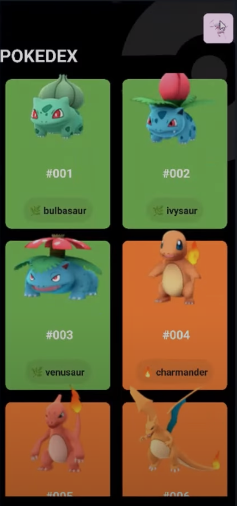
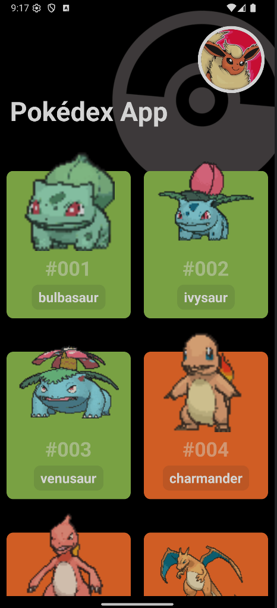

# Parte 05 — Pokedex

**Índice**

<!-- Índice actualizado -->

1. [Inicia en](#inicia-en)

## Inicia en

Inicia en: https://youtu.be/GaXEzkDs6Yk?t=20353

## Mockup



## Api

Se esta usando https://pokeapi.co/ , se creo el rchivo pokedex.http para las pruebas

```http
GET https://pokeapi.co/api/v2/pokemon/?limit=10
```

## Carga de pokemons usan tanstack

**_TIP: queryKey es el alias que usara para guardar en cache_**

```jsx
import { useQuery } from "@tanstack/react-query";
import axios from "axios";
import { StatusBar } from "expo-status-bar";
import { ActivityIndicator, FlatList, Text, View } from "react-native";
import { SafeAreaView } from "react-native-safe-area-context";
import styled from "styled-components/native";
function fetchPokemons() {
  return axios
    .get("https://pokeapi.co/api/v2/pokemon/?limit=100")
    .then((response) => response.data);
}

export default function Index() {
  const {
    data = [],
    isPending,
    error,
    refetch,
    isError,
  } = useQuery({
    queryKey: ["pokemons"],
    queryFn: fetchPokemons,
  });

  const renderContent = () => {
    if (isPending) {
      console.log("🌐 Cargando Pokémons...");
      return (
        <View>
          <ActivityIndicator size="large" color="tomato" />
          <Texto>Cargando Pokémons...</Texto>
        </View>
      );
    }

    if (isError) {
      console.log("❌ Error al cargar Pokémons:", error);
      return (
        <View>
          <ErrorText>❌ Error: {error?.message || "Algo salió mal"}</ErrorText>
          <RetryButton onPress={() => refetch()}>
            <RetryText>Reintentar</RetryText>
          </RetryButton>
        </View>
      );
    }
    console.log("✅ Pokémons cargados:", data.results.length);
    return (
      <BodyPokemons>
        <FlatList
          data={data.results}
          keyExtractor={(item) => item.name}
          renderItem={({ item, index }) => (
            <Text>
              {index + 1}. {item.name}
            </Text>
          )}
        />
      </BodyPokemons>
    );
  };

  return (
    <Contenedor>
      <StatusBar style="light" />
      <ImagenFondo />
      <Header>
        <ImageUser />
        <Title>Pokédex App</Title>
      </Header>
      {renderContent()}
    </Contenedor>
  );
}
...
```

## Carga de pokemon con mas info

- En este caso se hizo un get adicional por cada pokemon para obtener su tip y mas datos ya que no venia en la lista maestra
- Se uso algo nuevo Promise.all para esperar todos los async de map, si no se usa asi es una lista de promesas
- Los map se ejecutan en paralelo por lo cual el orden se mantiene al espear todas las promesas

```jsx
...
async function fetchPokemons() {
  const pokemonMasterList = await axios
    .get("https://pokeapi.co/api/v2/pokemon/?limit=100")
    .then((response) => response.data);

  const detailPokemonsPromises = pokemonMasterList.results.map(
    async (pokemonMaster) => {
      const detailsByPokemon = await axios
        .get(pokemonMaster.url)
        .then((response) => response.data);

      return {
        name: pokemonMaster.name,
        id: detailsByPokemon.id,
        url: pokemonMaster.url,
        image: detailsByPokemon.sprites.front_default,
        types: detailsByPokemon.types
          .map((typeInfo) => typeInfo.type.name)
          .join(", "),
      };
    }
  );

  return await Promise.all(detailPokemonsPromises);
}
...
```

## Carga de pokemon infinito

- La idea es poder scrolear hasta cargar todos lso pokemon

### Acercamiento inicial

- Primer acercamiento, se usa useuqryInifinite, declara las varuables nuevas
- se agregla configracion de cache 0 para poder probar mejor la pantalla
- al usar querinifnite la estructura que retorna cambia, notar que se debe agregar "resutlts" ya que es parte de la estructura que espera

```jsx
import { useInfiniteQuery } from "@tanstack/react-query";
...
async function fetchPokemons() {
  ...OJO
  return { results: resultAllPokemomWhitDetails };
}

export default function Index() {
  /**
  const {
    data = [],
    isPending,
    error,
    refetch,
    isError,
  } = useQuery({
    queryKey: ["pokemons"],
    queryFn: fetchPokemons,
  });
  */
  const {
    data = [],
    isPending,
    error,
    refetch,
    isError,
    fetchNextPage, //indica la funcion para cargar la siguiente pagina
    hasNextPage, //indica si hay mas paginas
    isFetchingNextPage, //indica si se esta cargando la siguiente pagina
  } = useInfiniteQuery({
    staleTime: 0,
    gcTime: 0,
    queryKey: ["pokemons"],
    queryFn: fetchPokemons,
    getNextPageParam: (p) => p.next || undefined,
  });

  const renderContent = () => {
    ...
    console.log("✅ Pokémons cargados: ", data.length);
    console.log(JSON.stringify(data, null, 2));//se ve "pages" en su estructura
    const allPokemonData = data?.pages?.flatMap((page) => page.results) ?? [];
    console.log("✅ Pokémons cargados: ", allPokemonData.length);
    console.log(JSON.stringify(allPokemonData, null, 2));
    return (
      <BodyPokemons>
        <FlatList
          data={allPokemonData}
          ...
          >
        </FlatList>
      </BodyPokemons>
    );
  };
  ...
}
...
```

### Ajustes para completar la carga paginada

- En flat List usamos el endReach para poder indicarle que hacer si llega al final ( similar a como hicimos en la seccion de Listas)
- Y usamos su propiueadde de ListFooterComponetne para mostra un indicador cuando carga
- Ambos casos usamos los datos que nos da queryinintie 'hasnextPage y isFetchinNextPage'

```jsx
<FlatList
  renderItem={({ item, index }) => <PokemonCard pokemon={item} />}
  onEndReached={() => {
    if (hasNextPage && !isFetchingNextPage) {
      console.log("Cargando siguiente pagina...");
      fetchNextPage();
    }
  }}
  ListFooterComponent={
    isFetchingNextPage ? (
      <ActivityIndicator size="large" color="tomato" />
    ) : null
  }
/>
```

- En la funcion fetchPokemons agregamos el aprametro pageParam, que es el parametro que usara queryInite para pasar la siguiente pagina
- ademas para que sepa que pagina llamar, en el resultado agregamos el resultado inicial donde estaba los metada datos de next page , esto lo usara userquerinite para hacer syu logica de llamar a la siguiente apgina hasta terminar

```jsx
async function fetchPokemons({pageParam="https://pokeapi.co/api/v2/pokemon/?limit=10"}) {

  const pokemonMasterList = await axios
    .get(pageParam)
    .then((response) => response.data);
  ...
  return { ...pokemonMasterList, results: resultAllPokemomWhitDetails };
}
```

## Card de pokemon como componte

en pokemon card se crea en lac arepta componente, con pokemon commoparematro

```jsx
import styled from "styled-components/native";

export function PokemonCard({ pokemon }) {
  return (
    <Contenedor>
      <Texto>{pokemon.name}</Texto>
    </Contenedor>
  );
}
...
```

OJO : en idnex se importa, si es default es sin llaves al iomprotar si solo export dsindefatul si se importa con llaves esto sirve cuando se tiene multimple export en un solo archivo

```jsx
...
import { PokemonCard } from "../../components/5-pokedex-components/PokemonCard";
...
export default function Index() {
  ...
  return (
      <BodyPokemons>
        <FlatList
          ...
          renderItem={({ item, index }) => <PokemonCard pokemon={item} />}
        />
      </BodyPokemons>
    );
  };
  ...
}
...
```

## PokeCard

Se realizo ajustes para que se parezca mas al mockup, apuntes:

- Se usa image gif si existe
- se usa un lsitado de colors por typo, se cambio para noc oncatenarlo sino que lo mape como lista
- se ajusto la iamgen para que se ajuste al gif
- Se ajusto lso marign, ver bien el absoute y relative de cada uno
- para imagens niamdas se vio que existia el libreria expo-image con mejor performance

```jsx
import styled from "styled-components/native";

export function PokemonCard({ pokemon }) {
  const POKEMON_TYPE_COLORS = {
    normal: "#A4ACAF",
    fire: "#FD7D24",
    water: "#4592C4",
    electric: "#EED535",
    grass: "#9BCC50",
    ice: "#51C4E7",
    fighting: "#D56723",
    poison: "#B97FC9",
    ground: "#F7DE3F",
    flying: "#3DC7EF",
    psychic: "#F366B9",
    bug: "#729F3F",
    rock: "#A38C21",
    ghost: "#7B62A3",
    dragon: "#53A4CF",
    dark: "#707070",
    steel: "#9EB7B8",
    fairy: "#FDB9E9",
  };
  const primaryType = pokemon.types[0];
  const backgroundColor = POKEMON_TYPE_COLORS[primaryType] || "#000";

  return (
    <Contenedor backgroundColor={backgroundColor}>
      <PokemonImage source={{ uri: pokemon.image }} />
      <PokemonID>#{(pokemon.id + "").padStart(3, 0)}</PokemonID>
      <PokemonName>{pokemon.name}</PokemonName>
    </Contenedor>
  );
}

const Contenedor = styled.View`
  flex: 1;
  justify-content: center;
  align-items: center;
  border-radius: 10px;
  background-color: ${(props) => props.backgroundColor || "#753030ff"};
  padding: 15px;
  margin: 10px;
  height: 220px;
  justify-content: center;
  position: relative;
  margin-top: 40px;
`;

const PokemonID = styled.Text`
  font-size: 30px;
  color: white;
  font-weight: bold;
  opacity: 0.5;
  margin-top: 70px;
`;

const PokemonImage = styled.Image.attrs({
  resizeMode: "contain",
})`
  height: 150px;
  width: 150px;
  position: absolute;
  top: -30px;
  justify-content: bottom;
  align-items: bottom;
`;

const PokemonName = styled.Text`
  font-size: 20px;
  font-weight: bold;
  background-color: rgba(45, 45, 45, 0.1);
  border-radius: 10px;
  padding: 5px 10px;
  color: #fff;
  position: absolute;
  bottom: 13px;
`;
```


