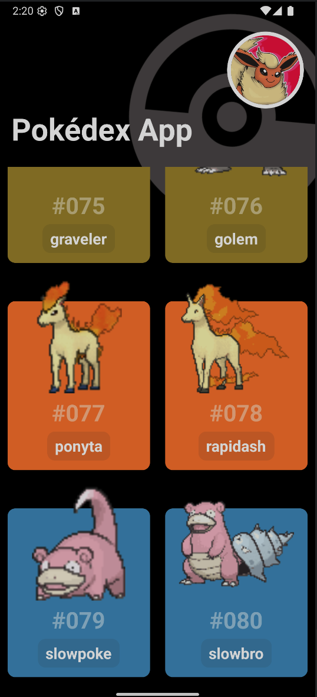
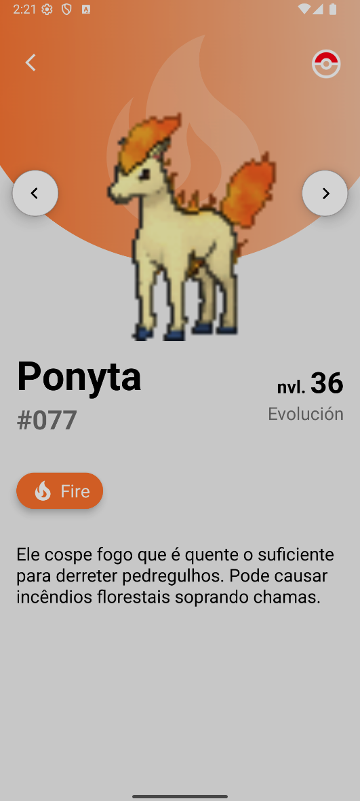
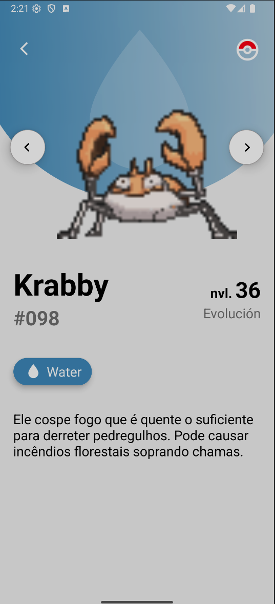

# Parte 05 — Pokédex

1. [Inicia en](#1-inicia-en)
2. [Mockup](#2-mockup)
3. [API](#3-api)
4. [Carga de pokémons usando TanStack](#4-carga-de-pokémons-usando-tanstack)
5. [Carga de pokémon con más información](#5-carga-de-pokémon-con-más-información)
6. [Carga de pokémon infinita](#6-carga-de-pokémon-infinita)
   - 6.1. [Acercamiento inicial](#61-acercamiento-inicial)
   - 6.2. [Ajustes para completar la carga paginada](#62-ajustes-para-completar-la-carga-paginada)
7. [Card de pokémon como componente](#7-card-de-pokémon-como-componente)
8. [PokéCard](#8-pokécard)
9. [Detail Pokémon](#9-detail-pokémon)
   - 9.1. [Básico enviar parámetro a otra pantalla](#91-básico-enviar-parámetro-a-otra-pantalla)
   - 9.2. [Creación de diseño](#92-creación-de-diseño)
   - 9.3. [Detalles finales según el mock](#93-detalles-finales-según-el-mock)

## 1. Inicia en

Inicia en: https://youtu.be/GaXEzkDs6Yk?t=20353

## 2. Mockup


## 3. API

Se está usando https://pokeapi.co/, se creó el archivo pokedex.http para las pruebas

```http
GET https://pokeapi.co/api/v2/pokemon/?limit=10
```

## 4. Carga de pokémons usando TanStack

**_TIP: queryKey es el alias que usará para guardar en caché_**

```jsx
import { useQuery } from "@tanstack/react-query";
import axios from "axios";
import { StatusBar } from "expo-status-bar";
import { ActivityIndicator, FlatList, Text, View } from "react-native";
import { SafeAreaView } from "react-native-safe-area-context";
import styled from "styled-components/native";
function fetchPokemons() {
  return axios
    .get("https://pokeapi.co/api/v2/pokemon/?limit=100")
    .then((response) => response.data);
}

export default function Index() {
  const {
    data = [],
    isPending,
    error,
    refetch,
    isError,
  } = useQuery({
    queryKey: ["pokemons"],
    queryFn: fetchPokemons,
  });

  const renderContent = () => {
    if (isPending) {
      console.log("🌐 Cargando Pokémons...");
      return (
        <View>
          <ActivityIndicator size="large" color="tomato" />
          <Texto>Cargando Pokémons...</Texto>
        </View>
      );
    }

    if (isError) {
      console.log("❌ Error al cargar Pokémons:", error);
      return (
        <View>
          <ErrorText>❌ Error: {error?.message || "Algo salió mal"}</ErrorText>
          <RetryButton onPress={() => refetch()}>
            <RetryText>Reintentar</RetryText>
          </RetryButton>
        </View>
      );
    }
    console.log("✅ Pokémons cargados:", data.results.length);
    return (
      <BodyPokemons>
        <FlatList
          data={data.results}
          keyExtractor={(item) => item.name}
          renderItem={({ item, index }) => (
            <Text>
              {index + 1}. {item.name}
            </Text>
          )}
        />
      </BodyPokemons>
    );
  };

  return (
    <Contenedor>
      <StatusBar style="light" />
      <ImagenFondo />
      <Header>
        <ImageUser />
        <Title>Pokédex App</Title>
      </Header>
      {renderContent()}
    </Contenedor>
  );
}
...
```

## 5. Carga de pokémon con más información

- En este caso se hizo un GET adicional por cada pokémon para obtener su tipo y más datos ya que no venía en la lista maestra
- Se usó algo nuevo Promise.all para esperar todos los async de map, si no se usa así es una lista de promesas
- Los map se ejecutan en paralelo por lo cual el orden se mantiene al esperar todas las promesas

```jsx
...
async function fetchPokemons() {
  const pokemonMasterList = await axios
    .get("https://pokeapi.co/api/v2/pokemon/?limit=100")
    .then((response) => response.data);

  const detailPokemonsPromises = pokemonMasterList.results.map(
    async (pokemonMaster) => {
      const detailsByPokemon = await axios
        .get(pokemonMaster.url)
        .then((response) => response.data);

      return {
        name: pokemonMaster.name,
        id: detailsByPokemon.id,
        url: pokemonMaster.url,
        image: detailsByPokemon.sprites.front_default,
        types: detailsByPokemon.types
          .map((typeInfo) => typeInfo.type.name)
          .join(", "),
      };
    }
  );

  return await Promise.all(detailPokemonsPromises);
}
...
```

## 6. Carga de pokémon infinita

- La idea es poder hacer scroll hasta cargar todos los pokémon

### 6.1. Acercamiento inicial

- Primer acercamiento, se usa useInfiniteQuery, declara las variables nuevas
- Se agrega configuración de caché 0 para poder probar mejor la pantalla
- Al usar queryInfinite la estructura que retorna cambia, notar que se debe agregar "results" ya que es parte de la estructura que espera

```jsx
import { useInfiniteQuery } from "@tanstack/react-query";
```

```jsx
...
async function fetchPokemons() {
  ...OJO
  return { results: resultAllPokemomWhitDetails };
}


export default function Index() {
  /**
  const {
    data = [],
    isPending,
    error,
    refetch,
    isError,
  } = useQuery({
    queryKey: ["pokemons"],
    queryFn: fetchPokemons,
  });
  */
  const {
    data = [],
    isPending,
    error,
    refetch,
    isError,
    fetchNextPage, //indica la funcion para cargar la siguiente pagina
    hasNextPage, //indica si hay mas paginas
    isFetchingNextPage, //indica si se esta cargando la siguiente pagina
  } = useInfiniteQuery({
    staleTime: 0,
    gcTime: 0,
    queryKey: ["pokemons"],
    queryFn: fetchPokemons,
    getNextPageParam: (p) => p.next || undefined,
  });

  const renderContent = () => {
    ...
    console.log("✅ Pokémons cargados: ", data.length);
    console.log(JSON.stringify(data, null, 2));//se ve "pages" en su estructura
    const allPokemonData = data?.pages?.flatMap((page) => page.results) ?? [];
    console.log("✅ Pokémons cargados: ", allPokemonData.length);
    console.log(JSON.stringify(allPokemonData, null, 2));
    return (
      <BodyPokemons>
        <FlatList
          data={allPokemonData}
          ...
          >
        </FlatList>
      </BodyPokemons>
    );
  };
  ...
}
...
```

### 6.2. Ajustes para completar la carga paginada

- En FlatList usamos el onEndReached para poder indicarle qué hacer si llega al final (similar a como hicimos en la sección de Listas)
- Y usamos su propiedad de ListFooterComponent para mostrar un indicador cuando carga
- En ambos casos usamos los datos que nos da queryInfinite 'hasNextPage e isFetchingNextPage'

```jsx
<FlatList
  renderItem={({ item, index }) => <PokemonCard pokemon={item} />}
  onEndReached={() => {
    if (hasNextPage && !isFetchingNextPage) {
      console.log("Cargando siguiente pagina...");
      fetchNextPage();
    }
  }}
  ListFooterComponent={
    isFetchingNextPage ? (
      <ActivityIndicator size="large" color="tomato" />
    ) : null
  }
/>
```

- En la función fetchPokemons agregamos el parámetro pageParam, que es el parámetro que usará useInfiniteQuery para pasar la siguiente página
- Además para que sepa qué página llamar, en el resultado agregamos el resultado inicial donde estaba los metadatos de next page, esto lo usará useInfiniteQuery para hacer su lógica de llamar a la siguiente página hasta terminar

```jsx
async function fetchPokemons({pageParam="https://pokeapi.co/api/v2/pokemon/?limit=10"}) {

  const pokemonMasterList = await axios
    .get(pageParam)
    .then((response) => response.data);
  ...
  return { ...pokemonMasterList, results: resultAllPokemomWhitDetails };
}
```

## 7. Card de pokémon como componente

En PokemonCard se crea en la carpeta componente, con pokémon como parámetro

```jsx
import styled from "styled-components/native";

export function PokemonCard({ pokemon }) {
  return (
    <Contenedor>
      <Texto>{pokemon.name}</Texto>
    </Contenedor>
  );
}
...
```

**OJO:** en index se importa, si es default es sin llaves al importar, si es solo export sin default se importa con llaves, esto sirve cuando se tiene múltiples exports en un solo archivo

```jsx
...
import { PokemonCard } from "../../components/5-pokedex-components/PokemonCard";
...
export default function Index() {
  ...
  return (
      <BodyPokemons>
        <FlatList
          ...
          renderItem={({ item, index }) => <PokemonCard pokemon={item} />}
        />
      </BodyPokemons>
    );
  };
  ...
}
...
```

## 8. PokéCard

Se realizaron ajustes para que se parezca más al mockup, apuntes:

- Se usa image gif si existe
- Se usa un listado de colores por tipo, se cambió para no concatenarlo sino que se mapeó como lista

- Se ajustó la imagen para que se ajuste al gif
- Se ajustaron los márgenes, ver bien el absolute y relative de cada uno
- Para imágenes animadas se vio que existía la librería expo-image con mejor performance

```jsx
import styled from "styled-components/native";

export function PokemonCard({ pokemon }) {
  const POKEMON_TYPE_COLORS = {
    normal: "#A4ACAF",
    fire: "#FD7D24",
    water: "#4592C4",
    electric: "#EED535",
    grass: "#9BCC50",
    ice: "#51C4E7",
    fighting: "#D56723",
    poison: "#B97FC9",
    ground: "#F7DE3F",
    flying: "#3DC7EF",
    psychic: "#F366B9",
    bug: "#729F3F",
    rock: "#A38C21",
    ghost: "#7B62A3",
    dragon: "#53A4CF",
    dark: "#707070",
    steel: "#9EB7B8",
    fairy: "#FDB9E9",
  };
  const primaryType = pokemon.types[0];
  const backgroundColor = POKEMON_TYPE_COLORS[primaryType] || "#000";

  return (
    <Contenedor backgroundColor={backgroundColor}>
      <PokemonImage source={{ uri: pokemon.image }} />
      <PokemonID>#{(pokemon.id + "").padStart(3, 0)}</PokemonID>

      <PokemonName>{pokemon.name}</PokemonName>
    </Contenedor>
  );
}

const Contenedor = styled.View`
  flex: 1;
  justify-content: center;
  align-items: center;
  border-radius: 10px;
  background-color: ${(props) => props.backgroundColor || "#753030ff"};
  padding: 15px;
  margin: 10px;
  height: 220px;
  justify-content: center;
  position: relative;
  margin-top: 40px;
`;

const PokemonID = styled.Text`
  font-size: 30px;
  color: white;
  font-weight: bold;
  opacity: 0.5;
  margin-top: 70px;
`;

const PokemonImage = styled.Image.attrs({
  resizeMode: "contain",
})`
  height: 150px;
  width: 150px;
  position: absolute;
  top: -30px;
  justify-content: bottom;
  align-items: bottom;
`;

const PokemonName = styled.Text`
  font-size: 20px;
  font-weight: bold;
  background-color: rgba(45, 45, 45, 0.1);
  border-radius: 10px;
  padding: 5px 10px;
  color: #fff;
  position: absolute;
  bottom: 13px;
`;
```


## 9. Detail Pokémon

### 9.1. Básico enviar parámetro a otra pantalla

- Se usa más propiedades del push, pathname y params, pero no se puede pasar el objeto como tal, sino en JSON

```jsx
import { router } from "expo-router";

export function PokemonCard({ pokemon }) {
  return (
    <Contenedor
      backgroundColor={backgroundColor}
      onPress={() =>
        router.push({
          pathname: "detail",
          params: {
            item: JSON.stringify(pokemon),
          },
        })
      }
    >
      ...
    </Contenedor>
  );
}

const Contenedor = styled.TouchableOpacity`
...
`;
```

- Y al recibirlo usar useLocalSearchParams para obtenerlo y deserializarlo

```jsx
import { useLocalSearchParams } from "expo-router";
import styled from "styled-components/native";

export default function DetailScreen() {
  const { item } = useLocalSearchParams();
  const pokemon = JSON.parse(item);

  return (
    <Contenedor>
      <Texto>Componente DEtail {pokemon.name}</Texto>
    </Contenedor>
  );
}
```

### 9.2. Creación de diseño

En el video se presenta un mockup, que lo veo posible con lo enseñado, para probar algunas cosas adicionales, trataré de hacer este diseño:

Fuente: https://dribbble.com/shots/19202307-Pokedex-Pokemon-App

Figma: https://www.figma.com/design/zqFEwQGEbrIcAff6nyhzW7/Untitled?node-id=1-23&t=cAhhkpnerbtVDTj1-0


### 9.3. Detalles finales según el mock







:)
